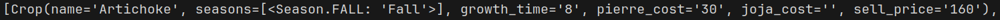
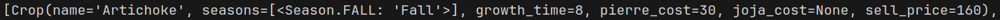

# Hydrating Crops
In [this commit](https://github.com/Gurthog/crop-calculator/compare/26650e703db978c83ce4b12c04fc71f9b4194673...cf45f92f8322e931f6c15c7ef16678afd2a5e78e) I added a basic way to load crop data from a csv into a list of `Crop` objects.

On first attempt, I noticed something very pythony:

Everything is still a string! I would need a way to convert each value into its intended type.
Writing code to cast each field one by one could work, but would be pretty repetitive and no doubt I'll be adding more values to each crop later. I want something that spares me from writing new type casting code each time I add a value.

`dataclasses.fields` saves the day by providing a way to loop through the fields of the dataclass and access their name and type. It allowed me to build a dictionary containing a lambda function for each field which assigns `None` for nulls, and otherwise casts the value to the fields type.


It worked!

# Seasons
In python, when a value can be one of a few specific things (for example, the four seasons) I like to avoid raw strings or other literals. It feels messy to need a string equality check each time I check for a season. Plus, it's a new literal each time I need to do it. If one literal needs to change, I suddenly find myself tracking down each time it was typed. Messy!!

To use concrete values throughout the code, I created the `Season` Enum class.
If a `parsnip` is a Spring crop, `if parsnip.season is Season.SPRING` feels like a clean way to check.

Certain crops in Stardew are available in more than one season, however, so `Crop.seasons` needs to be a list. This triggered some pause to think about how seasons would be stored in the csv. Using a pipe character to separate seasons felt like the right choice, over using a new column for each season. The seasons value for Corn would then be `summer|fall`.
I can map seasons from the file into a list of their Enum value counterparts with the following:

```python
seasons = row["seasons"].upper().split("|")
row["seasons"] = [Season[s] for s in seasons]
```

Now, seasons are checked with `if Season.SPRING in crop.seasons`. Nice.

This is enough data now to start prototyping the window and some controls.

Previous: [git init](1_git-init.md)

